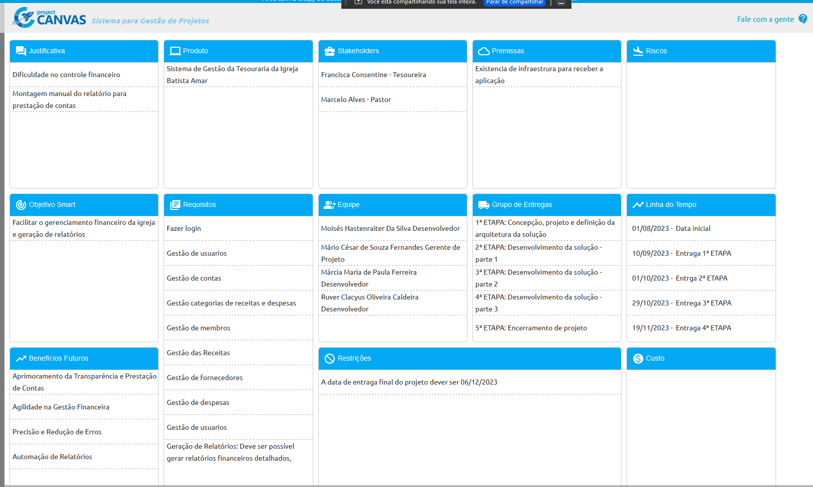
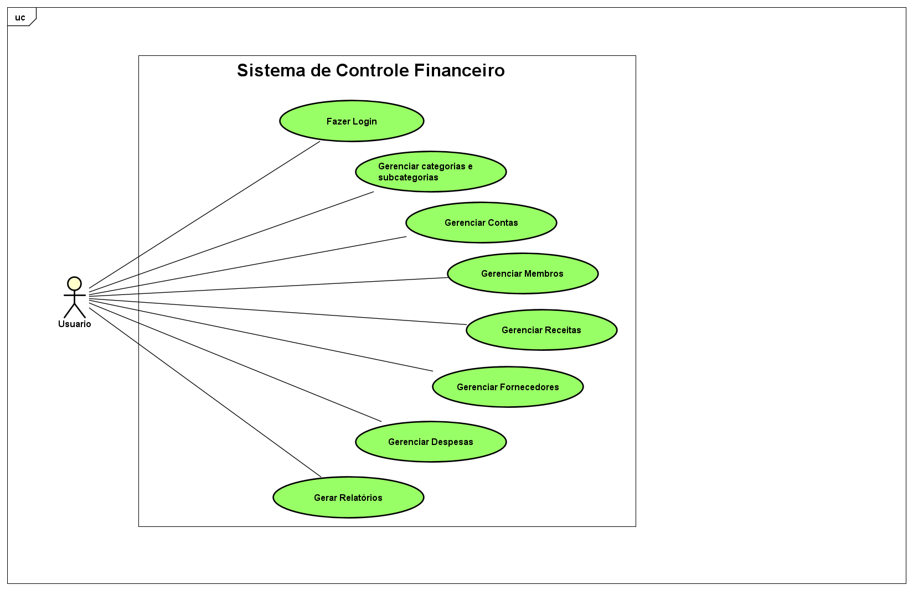
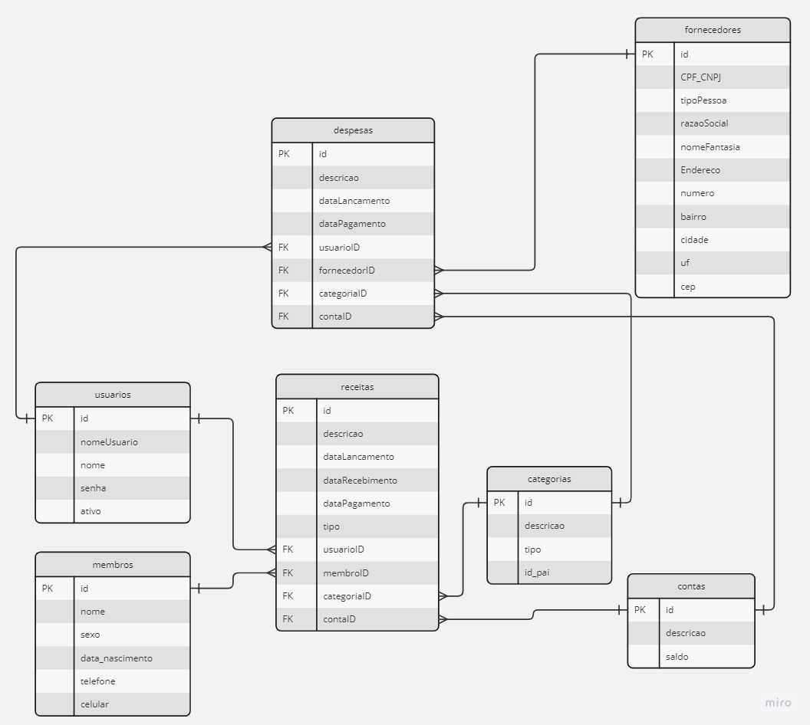

# Especificações do Projeto

A Igreja Batista Amar, ciente da importância da transparência e eficiência na gestão financeira, enfrenta desafios significativos em seu atual processo manual de controle financeiro. A equipe responsável encontra dificuldades em lidar com a volumosa quantidade de transações, que incluem ofertas, dízimos, doações, bem como diversas despesas associadas à manutenção do templo, funcionários e encargos legais.

Persona Francisca Consentine-Tesoureira, uma mulher aposentada 

Apresente uma visão geral do que será abordado nesta parte do documento, enumerando as técnicas e/ou ferramentas utilizadas para realizar a especificações do projeto

## Arquitetura e Tecnologias

o	Descreva brevemente a arquitetura definida para o projeto e as tecnologias a serem utilizadas. Sugere-se a criação de um diagrama de componentes da solução.

## Project Model Canvas

## Requisitos

As tabelas que se seguem apresentam os requisitos funcionais e não funcionais que detalham o escopo do projeto. Para determinar a prioridade de requisitos, aplicar uma técnica de priorização de requisitos e detalhar como a técnica foi aplicada.

### Requisitos Funcionais

|  ID  | Descrição do Requisito  | Prioridade |
|------|-----------------------------------------|----|
|RF-001|Fazer login.| ALTA | 
|RF-002|Gestão de usuarios.| ALTA | 
|RF-003|Gestão de contas.| ALTA |
|RF-004|Gestão categorias de receitas e despesas.| ALTA |
|RF-005|Gestão de membros.| ALTA |
|RF-006|Gestão das Receitas.| ALTA |
|RF-007|Gestão de fornecedores.| ALTA |
|RF-008|Gestão de despesas.| ALTA |
|RF-009|Gestão de usuarios .| ALTA |
|RF-010|Geração de Relatórios: Deve ser possível gerar relatórios financeiros detalhados, incluindo demonstrativos de entradas e saídas por categoria, resumos financeiros e saldos bancários.| ALTA |

### Requisitos não Funcionais

|ID     | Descrição do Requisito  |Prioridade |
|-------|-------------------------|----|
|RNF-001|Usabilidade: o aplicativo deve ser fácil e intuitivo de usar, para que os usuários possam encontrar os serviços que precisam de forma rápida e eficiente. | Alta | 
|RNF-002|Desempenho: o aplicativo deve ser rápido e responsivo, mesmo quando muitos usuários estão acessando simultaneamente. | Alta |
|RNF-003|Confiabilidade: o aplicativo deve ser confiável e estar disponível 24 horas por dia, 7 dias por semana, para que os usuários possam acessá-lo sempre que precisarem. | Alta | 
|RNF-004|Segurança: o aplicativo deve ser seguro e proteger as informações pessoais e financeiras dos usuários. | Alta | 
|RNF-005|Escalabilidade: o aplicativo deve ser capaz de lidar com um grande número de usuários e fornecedores de serviços, sem comprometer o desempenho e a usabilidade. | Alta  | 

Com base nas Histórias de Usuário, enumere os requisitos da sua solução. Classifique esses requisitos em dois grupos:

## Restrições

O projeto está restrito pelos itens apresentados na tabela a seguir.

|ID| Restrição                                             |
|--|-------------------------------------------------------|
|01| O projeto deverá ser entregue até o final do semestre |
|02| Não pode ser desenvolvido um módulo de backend        |

Enumere as restrições à sua solução. Lembre-se de que as restrições geralmente limitam a solução candidata.

## Diagrama de Casos de Uso

## Modelo ER (Projeto Conceitual)

## Projeto da Base de Dados

O projeto da base de dados corresponde à representação das entidades e relacionamentos identificadas no Modelo ER, no formato de tabelas, com colunas e chaves primárias/estrangeiras necessárias para representar corretamente as restrições de integridade.
